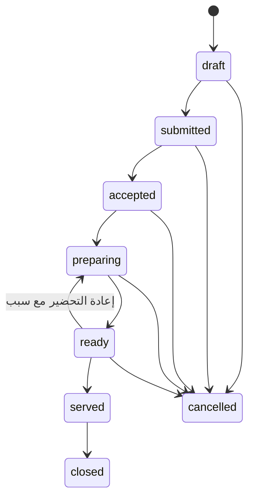

# دورة طلبات تكة داخل رواق

**الحالة:** تصميم أمامي جاهز للمراجعة، ولم يطبق على أي قاعدة بيانات.

**ملف التنفيذ:** `supabase/migrations/047_restaurant_order_lifecycle.sql`

## الهدف

تفصل هذه الدورة بين تشغيل المطعم وبين المحاسبة:

1. الجرسون يرسل الطلب مرة واحدة بمفتاح منع تكرار ثابت.
2. كل عنصر يحمل `station_id` محفوظاً، فلا يعتمد التوجيه على اسم الصنف.
3. كل محطة ترى عناصرها وتغير حالتها عبر RPC ذري.
4. حالة الطلب تجمع آلياً من حالات عناصره.
5. يمكن ربط الطلب لاحقاً بفاتورة عميل موجودة، لكن الربط لا ينشئ دفعة أو قيداً أو حركة مخزون.
6. تبقى الفاتورة والدفع وخصم المخزون ضمن محرك POS والمحاسبة الحاليين.

هذا يمنع المشكلة الحالية التي تجعل تذكرة المطبخ نتيجة للدفع، ويتيح إرسال الطعام للمطبخ قبل التحصيل من دون إنشاء مستند مالي مبكر.

## الكيانات

### `kitchen_stations`

محطات إنتاج مرتبطة بالمؤسسة والفرع، مثل الساخن والبار والحلويات. الإيقاف يتم عبر `is_active=false` ولا يوجد حذف.

### `kitchen_station_devices`

يربط جهاز القسم بمحطة أو أكثر داخل الفرع نفسه. جهاز KDS لا يستطيع تحديث عنصر محطة أخرى حتى لو عرف معرّفه.

### `restaurant_orders`

رأس الطلب التشغيلي، ويحتوي على:

- المؤسسة والفرع والطاولة والجرسون.
- اسم العميل ورقمه وقناة البيع وعدد الضيوف والملاحظات والحساسيات.
- لقطة مالية عشرية: الإجمالي قبل الخصم، خصومات العناصر، خصم الطلب، الضريبة، الرسوم والإجمالي النهائي.
- `idempotency_key` فريد داخل المؤسسة.
- رابط اختياري لاحق إلى `customer_invoices`.
- منفذ واحد واضح: مستخدم أو جهاز قسم، وليس الاثنين.

### `restaurant_order_items`

لقطة غير قابلة لتغيير محتواها بعد الإرسال. تحفظ الصنف والكمية والسعر والخصم والضريبة والإضافات والحساسيات والمحطة. المسموح بعد ذلك هو انتقال الحالة فقط.

### `restaurant_order_status_events`

سجل أحداث غير قابل للتعديل أو الحذف. لكل حدث تسلسل داخل الطلب، ومفتاح منع تكرار، وحالة سابقة ولاحقة، وسبب، وهوية المستخدم أو الجهاز.

## دورة الحياة



انتقالات العناصر هي `submitted → accepted → preparing → ready → served`. يسمح الإلغاء من الحالات غير النهائية مع سبب، ويسمح `ready → preparing` لإعادة التحضير مع سبب. لا تعدل حالة الطلب يدوياً خلال الإنتاج؛ بل تجمع كما يلي:

- كل العناصر ملغاة: `cancelled`.
- كل العناصر مقدمة أو ملغاة: `served`.
- كل العناصر جاهزة أو مقدمة أو ملغاة: `ready`.
- وجود عنصر قيد التحضير أو جاهز أو مقدم مع عناصر أبطأ: `preparing`.
- كل العناصر مقبولة أو ملغاة: `accepted`.
- غير ذلك: `submitted`.

الإغلاق فقط من `served`. الإلغاء الكامل ممنوع بعد تقديم أي عنصر.

## واجهات الكتابة

لا توجد سياسات RLS للكتابة المباشرة. الأدوار `anon` و`authenticated` و`service_role` لا تملك تعديل الجداول، وتستخدم الوظائف الآتية:

| RPC | الغرض |
|---|---|
| `upsert_kitchen_station_atomic` | إنشاء محطة أو تعديلها من المالك أو مدير الفرع |
| `assign_kitchen_station_device_atomic` | ربط جهاز قسم بمحطة داخل الفرع نفسه |
| `submit_restaurant_order_atomic` | التحقق من الطلب وحساب أسعاره وإنشاؤه وإرساله ذرّياً |
| `transition_restaurant_order_item_atomic` | انتقال عنصر واحد وإعادة تجميع حالة الطلب ذرّياً |
| `transition_restaurant_order_atomic` | إغلاق الطلب أو إلغاؤه بالكامل |
| `link_restaurant_order_invoice_atomic` | ربط فاتورة موجودة متطابقة بالطلب، من دون إنشاء دفعة |

المستخدم المباشر لا يستطيع تمرير هوية مستخدم آخر. جهاز القسم يقبل فقط عبر مسار خادم يستخدم `service_role` بعد التحقق من مفتاح الجهاز، ويجب أن تتطابق المؤسسة والفرع والوحدة والمحطة.

## عقد عناصر الإرسال

يستقبل `submit_restaurant_order_atomic` مصفوفة JSON بهذا الشكل:

```json
[
  {
    "client_line_id": "mobile-order-42-line-1",
    "catalog_item_id": "00000000-0000-0000-0000-000000000001",
    "station_id": "00000000-0000-0000-0000-000000000002",
    "quantity": "2.0000",
    "unit_price": "4.5000",
    "discount_amount": "0.0000",
    "notes": "بدون بصل",
    "allergens": ["حليب"],
    "modifiers": [{"name": "جبنة إضافية", "price": "0.5000"}],
    "price_override_reason": null
  }
]
```

`client_line_id` ثابت وفريد داخل الطلب. السعر المتوقع يؤخذ من `catalog_items.branch_price` ثم `retail_price`. تغيير السعر أو إضافة خصم يحتاج دوراً مخولاً، وتغيير السعر يحتاج سبباً. الضريبة تؤخذ من الصنف وتحسب في الخادم باستخدام `numeric(14,4)`.

## العزل وعدم التسرب

- كل جدول تشغيلي يحمل `organization_id` و`branch_id`.
- المراجع الحرجة مركبة، لذلك لا يمكن ربط محطة أو طاولة أو جهاز أو فاتورة من مؤسسة أو فرع آخر.
- القراءة تستخدم `can_access_branch` وليس عضوية المؤسسة العامة فقط.
- الجهاز يحتاج تطابق المؤسسة والفرع، وحدة مناسبة في `allowed_modules`، وربطاً فعالاً بالمحطة عند تحديث عنصر.
- مفاتيح منع التكرار فريدة، وتستخدم الوظائف أقفالاً للطلبات عند الإرسال أو الانتقال.

## العلاقة بالمحاسبة والمخزون

الطلب التشغيلي لا ينشئ أي سجل في:

- `customer_invoice_payments`
- `journal_entries` أو `journal_lines`
- `stock_movements`

وظيفة الربط تتحقق من تطابق المؤسسة والفرع والإجمالي وحالة الفاتورة، ثم تحفظ `customer_invoice_id` وتسجل حدثاً وتدقيقاً فقط. إنشاء الفاتورة والتحصيل وخصم الوصفة يبقى في مسار POS الذري الحالي. بهذه الطريقة لا يحدث دفع وهمي ولا خصم مخزون مرتين.

## فحوص ما قبل التطبيق

تشغل هذه الاستعلامات قراءة فقط على نسخة staging قبل قبول الترحيل:

```sql
-- يجب أن تكون التبعيات موجودة.
select to_regclass('public.branches') as branches,
       to_regclass('public.restaurant_tables') as restaurant_tables,
       to_regclass('public.catalog_items') as catalog_items,
       to_regclass('public.menu_items') as menu_items,
       to_regclass('public.customer_invoices') as customer_invoices,
       to_regclass('public.department_api_keys') as department_api_keys,
       to_regclass('public.audit_logs') as audit_logs,
       to_regclass('public.document_sequences') as document_sequences;

-- يجب أن يعيد صفراً؛ الصفوف القديمة غير المكتملة لا تصلح كأجهزة KDS حتى تصحح.
select count(*) as malformed_active_devices
from public.department_api_keys
where is_active = true
  and (organization_id is null or branch_id is null or key_hash is null);

-- يجب أن يعيد صفراً؛ يكشف أي عضوية فرع لا يطابق مؤسستها.
select count(*) as cross_tenant_memberships
from public.organization_memberships om
join public.branches b on b.id = om.branch_id
where om.branch_id is not null and b.organization_id <> om.organization_id;

-- يجب أن يعيد صفراً قبل إضافة المفتاح المركب للطاولات.
select count(*) as cross_tenant_tables
from public.restaurant_tables rt
join public.branches b on b.id = rt.branch_id
where b.organization_id <> rt.organization_id;

-- يجب أن يعيد صفراً قبل إضافة المفتاح المركب للفواتير.
select count(*) as cross_tenant_invoices
from public.customer_invoices ci
join public.branches b on b.id = ci.branch_id
where b.organization_id <> ci.organization_id;
```

أي نتيجة غير صفرية توقف التطبيق. لا تحذف الصفوف؛ صحح المؤسسة أو الفرع بسجل تدقيق بعد إثبات المالك الصحيح.

## فحوص ما بعد التطبيق

```sql
-- الجداول والوظائف موجودة.
select to_regclass('public.kitchen_stations'),
       to_regclass('public.kitchen_station_devices'),
       to_regclass('public.restaurant_orders'),
       to_regclass('public.restaurant_order_items'),
       to_regclass('public.restaurant_order_status_events');

select proname, prosecdef
from pg_proc
where pronamespace = 'public'::regnamespace
  and proname in (
    'submit_restaurant_order_atomic',
    'transition_restaurant_order_item_atomic',
    'transition_restaurant_order_atomic',
    'link_restaurant_order_invoice_atomic'
  );

-- يجب ألا توجد سياسات كتابة مباشرة.
select tablename, policyname, cmd
from pg_policies
where schemaname = 'public'
  and tablename in (
    'kitchen_stations','kitchen_station_devices','restaurant_orders',
    'restaurant_order_items','restaurant_order_status_events'
  )
order by tablename, cmd;

-- يجب ألا يملك authenticated أو anon أو service_role كتابة مباشرة.
select grantee, table_name, privilege_type
from information_schema.role_table_grants
where table_schema = 'public'
  and table_name in (
    'kitchen_stations','kitchen_station_devices','restaurant_orders',
    'restaurant_order_items','restaurant_order_status_events'
  )
  and privilege_type in ('INSERT','UPDATE','DELETE','TRUNCATE');

-- اتساق الإجماليات، ويجب أن يعيد صفراً.
select count(*) as invalid_order_totals
from public.restaurant_orders
where total <> round(subtotal - discount_total + tax_total + service_fee + delivery_fee, 4)
   or discount_total <> round(item_discount_total + order_discount, 4);

select count(*) as invalid_item_totals
from public.restaurant_order_items
where line_subtotal <> round(quantity * unit_price, 4)
   or line_total <> round(line_subtotal - discount_amount + tax_amount, 4);

-- مسارات تسلسل الأحداث، ويجب أن يعيد صفراً.
with ordered as (
  select organization_id, order_id, event_sequence,
         lag(event_sequence) over (
           partition by organization_id, order_id order by event_sequence
         ) as previous_sequence
  from public.restaurant_order_status_events
)
select count(*) as sequence_gaps
from ordered
where previous_sequence is not null and event_sequence <> previous_sequence + 1;

-- أي توجيه عابر للفرع، ويجب أن يعيد صفراً.
select count(*) as invalid_station_routes
from public.restaurant_order_items roi
join public.kitchen_stations ks on ks.id = roi.station_id
where ks.organization_id <> roi.organization_id or ks.branch_id <> roi.branch_id;

-- الربط وحده لا ينشئ دفعة. يراجع يدوياً حول وقت اختبار الربط.
select ro.id, ro.customer_invoice_id, ro.total, ci.total as invoice_total,
       (select count(*) from public.customer_invoice_payments cip
        where cip.customer_invoice_id = ro.customer_invoice_id) as payment_count
from public.restaurant_orders ro
join public.customer_invoices ci on ci.id = ro.customer_invoice_id
where ro.customer_invoice_id is not null;
```

## سيناريوهات قبول إلزامية

1. إعادة طلب بنفس `idempotency_key` تعيد الطلب نفسه ولا تضيف عناصر أو أحداثاً.
2. مستخدم من مؤسسة أخرى لا يقرأ الطلب ولا يرسله ولا يغيره.
3. عضو مربوط بفرع آخر لا يقرأ طلب الفرع المستهدف.
4. جهاز KDS غير مربوط بالمحطة يرفض انتقال العنصر.
5. انتقال غير قانوني مثل `submitted → ready` يرفض ولا يكتب حدثاً.
6. إلغاء عنصر أو طلب من دون سبب يرفض.
7. إعادة التحضير `ready → preparing` من دون سبب ترفض.
8. فشل أي عنصر داخل الإرسال يلغي العملية كلها، ولا يبقى رأس طلب يتيم.
9. تزامن محاولتي انتقال بالعنصر نفسه ينتج انتقالاً واحداً صالحاً وسجل أحداث متسقاً.
10. ربط فاتورة من فرع آخر أو بإجمالي مختلف يرفض.
11. ربط الفاتورة لا ينشئ صف دفع ولا قيداً ولا حركة مخزون.
12. محاولة `DELETE` أو تعديل حدث قديم ترفض حتى عند تجاوز RLS المعتاد.

## خطة التصحيح الأمامي

لا يستخدم rollback بحذف الطلبات أو الأحداث. عند اكتشاف مشكلة بعد التطبيق:

1. أوقف استدعاء RPC المتأثر من التطبيق، وأبق القراءة متاحة.
2. عطّل المحطة أو ربط الجهاز عبر `is_active=false` بدلاً من الحذف.
3. أضف migration تالية تصلح الدالة أو القيد؛ لا تعدل `047` بعد تطبيقه.
4. للطلب الخاطئ، استخدم حدث إلغاء بسبب واضح ثم أنشئ طلباً جديداً بمفتاح جديد.
5. إذا كان رابط الفاتورة خاطئاً، لا تفك الربط بتعديل يدوي. أضف RPC تصحيحاً أمامياً يسجل حدث `invoice_link_corrected`، ويتحقق من عدم وجود أثر مالي مخالف قبل تغيير الرابط.
6. إذا وجدت حالة مشتقة غير صحيحة، أعد بناء حالة الرأس من سجل العناصر داخل migration تصحيحية، وسجل القيمة القديمة والجديدة في `audit_logs`.
7. احتفظ بنسخة احتياطية واختبر التصحيح على staging، ثم شغل جميع استعلامات الاتساق أعلاه.

## حدود هذا الترحيل

- لا يغير صفحات POS أو KDS الحالية؛ يلزم توصيلها بهذه RPCs في مرحلة التطبيق.
- لا يرحل `kitchen_tickets` القديمة، لأنها مرتبطة بفواتير مدفوعة ولا يجوز تحويلها بافتراضات.
- لا يطبق migration ولا يولد TypeScript types تلقائياً. بعد القبول يجب تطبيقه على staging أولاً ثم تحديث `src/types/database.ts` واختبارات الخادم وPlaywright.
- لا يضيف صلاحيات خطية جديدة؛ يستخدم أدوار رواق الحالية مع عزل الفرع وربط أجهزة المحطات.
